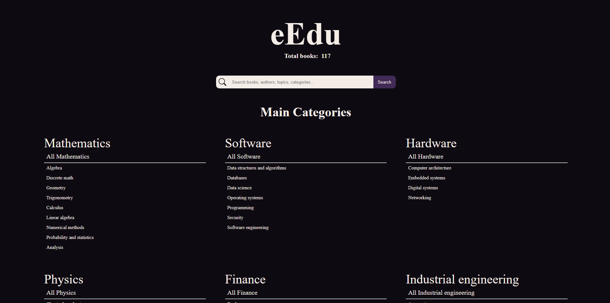

# eEdu

---

eEdu is a personal library with over 100 books that I've been reading, I'm yet to read or I've read throught my carrer.

The main topics of the books are:

- Mathematics (algebra, calculus, geometry, trigonometry, analysis, etc.)
- Software related (programming, systems, OS, databases, etc.)
- Hardware related (circuits, embbeded systems, digital systems, etc.)
- Physics
- Finance
- Industrial engineering

You can visit the site [here](https://eedu.onrender.com).

Future updates will only include more books or fixes.
